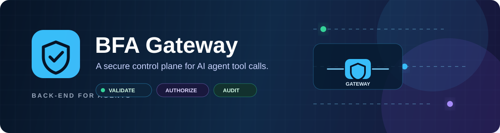
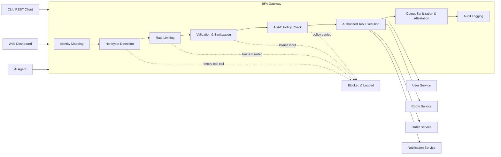

<p align="center">
  
</p>

<p align="center">
  <strong>A secure TypeScript gateway that gives AI agents controlled access to internal business tools.</strong>
</p>

<p align="center">
  <a href="#quick-start">Quick start</a> ·
  <a href="#architecture">Architecture</a> ·
  <a href="#api-reference">API</a> ·
  <a href="#production-considerations">Production notes</a>
</p>

[](https://nodejs.org/)
[](https://www.typescriptlang.org/)
[](https://expressjs.com/)


BFA Gateway sits between an AI agent and internal services. Every tool call is validated, checked against policy, rate-limited, audited, and only then executed. The project includes a REST API, browser dashboard, CLI, agent simulations, and automated checks.

> **Built for agent safety.** Give agents useful business tools without giving them unrestricted access to your internal services.

| Control plane | Developer experience | Visibility |
| --- | --- | --- |
| Validate, authorize, limit, and sanitize every tool call. | Run through the dashboard, CLI, REST API, or scenario simulator. | Inspect trace IDs, verdicts, and sanitized responses in one audit trail. |

## Highlights

- **Safe tool execution** — a centralized gateway processes every tool call before it reaches a service.
- **Access control** — role-, ownership-, and quantity-based policies protect profiles, bookings, orders, and notifications.
- **Input and output protection** — schema validation, parameter allowlisting, injection-pattern checks, and sensitive-field removal.
- **Active defense** — decoy administrative tools expose suspicious privilege-escalation attempts.
- **Abuse protection** — per-tool and per-user sliding-window rate limits help prevent runaway agent loops.
- **Traceability** — each request receives a trace ID; outcomes and response data are recorded for local inspection.
- **Developer experience** — dashboard, CLI, API, scenario simulator, and project verification commands included.

## Architecture



### Execution outcomes

| Verdict | Meaning |
| --- | --- |
| `ALLOWED` | The request passed all controls and reached its target service. |
| `DENIED` | The request failed identity or policy checks. |
| `INVALID_INPUT` | The tool name or arguments failed validation. |
| `RATE_LIMITED` | The caller exceeded a configured request limit. |
| `HONEYPOT_TRIGGERED` | The caller invoked a decoy security tool. |

## Features

### Gateway controls

| Component | What it does |
| --- | --- |
| Tool registry | Defines nine agent-visible business tools across user, room, order, and notification domains. |
| Validator and sanitizer | Validates tool arguments, drops undeclared fields, blocks unsafe patterns, and removes sensitive response metadata. |
| ABAC policy engine | Applies six policies for profile isolation, booking ownership, restricted orders, quantity limits, order ownership, and notification targets. |
| Rate limiter | Limits each user to five calls per tool and 12 total calls across tools within 10 seconds. |
| Identity mapper | Resolves the caller to a user, role, and agent context in the demo environment. |
| Honeypots | Detects calls to decoy privilege-escalation tools and returns a dedicated verdict. |
| Schema filtering | Excludes honeypot tools from schemas exposed to agents. |
| Audit logger | Stores recent execution records locally, with filtering by verdict, user, or tool. |
| Response attestation | Adds an HMAC-based metadata marker to successful response data. |

### Included interfaces

- **Web dashboard** for natural-language chat, raw tool execution, simulations, audit inspection, tool discovery, and metrics.
- **REST API** for programmatic tool calls and operational data.
- **CLI agent** for interactive and one-shot commands.
- **Scenario simulator** with normal campus, faculty procurement, and adversarial workflows.
- **Verification suite** covering gateway controls and benchmark scenarios.

## Quick start

### Prerequisites

- Node.js 18 or later
- npm 9 or later

### Run locally

```bash
git clone https://github.com/gnaneswar449/bfa-gateway.git
cd bfa-gateway
npm install
npm start
```

Open [http://localhost:3000](http://localhost:3000) to use the dashboard.

### Run with Docker

```bash
docker build -t bfa-gateway .
docker run --rm -p 3000:3000 bfa-gateway
```

## Usage

### Verify the project

```bash
npm test
```

The command builds the project, runs the security-sector checks, and runs local benchmark scenarios.

### Use the CLI

```bash
npm run agent
npm run agent -- "Show my timetable"
npm run agent -- "Find available rooms in bldg_cs"
```

### Execute a tool through the API

```bash
curl -X POST http://localhost:3000/api/bfa/execute \
  -H "Content-Type: application/json" \
  -d '{"userToken":"usr_student_01","toolName":"get_user_timetable","args":{"userId":"usr_student_01"}}'
```

## API reference

| Method | Endpoint | Description |
| --- | --- | --- |
| `GET` | `/api/bfa/health` | Gateway health and visible-tool count. |
| `GET` | `/api/bfa/tools` | Agent-visible tool definitions. |
| `POST` | `/api/bfa/execute` | Executes a tool call through the gateway. |
| `POST` | `/api/bfa/chat` | Processes a natural-language request with the demo agent. |
| `POST` | `/api/bfa/simulate` | Runs a `campus_normal`, `faculty_procurement`, or `adversarial_attack` scenario. |
| `GET` | `/api/bfa/audit-logs` | Local audit records; supports `verdict`, `userId`, and `toolName` filters. |
| `POST` | `/api/bfa/audit-logs/clear` | Clears local audit records. |
| `GET` | `/api/bfa/metrics` | Returns cached benchmark metrics. |
| `POST` | `/api/bfa/metrics/run` | Runs and returns the benchmark suite. |

## Project structure

```text
src/
├── agents/           Demo agent and predefined scenarios
├── bfa-gateway/      Gateway pipeline and security controls
├── evaluation/       Verification and benchmark scripts
├── microservices/    In-memory domain-service implementations
├── public/           Dashboard assets
├── cli.ts            Interactive command-line client
└── server.ts          Express API and static dashboard host
```

## Production considerations

This repository is a local demonstration project. Before a production deployment, use an external identity provider, store secrets in managed configuration, persist audit records in protected append-only storage, secure administrative endpoints, and use a shared rate-limit store for multiple instances.

## License

ISC
